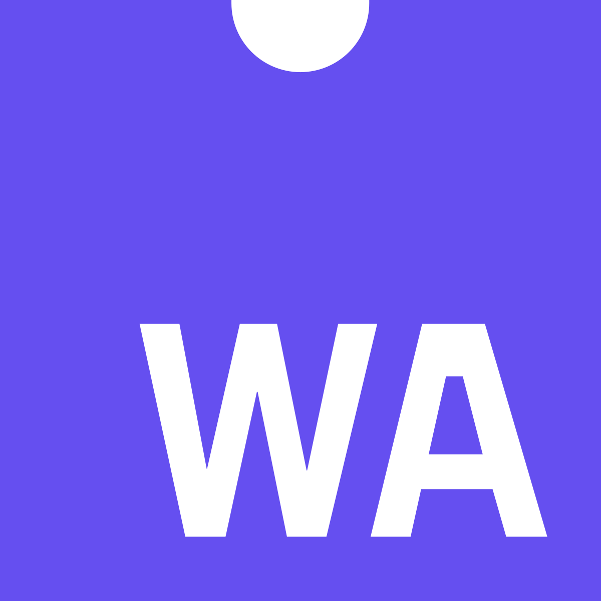

<h1 align = "center">Olá, sou <a href="https://facobackup-profile.vercel.app/">Gustavo Roque</a></h1>

  Desenvolvedor web, programador gráfico e estudante de <b>engenharia da computação</b> no 7 semestre.

---

## Sobre mim:
- Desenvolvedor web full-stack com 2 anos de experiência.
- Desenvolvedor da [Fabric UI](https://github.com/fabric-ui) (Módulos de componentes para ReactJS).
- Programador gráfico a 1 ano.
- Desenvolvedor de uma [demo simples usando os fundamentos de programação gráfica](https://engine-demo.vercel.app/).
- Desenvolvedor da [Projection Engine](https://github.com/projection-engine)
- Aprendendo Rust e webassembly.

---

### Github:

  

--- 

### Linguagens e ferramentas:
 

&nbsp;&nbsp;&nbsp;&nbsp;&nbsp;&nbsp;
&nbsp;&nbsp;&nbsp;&nbsp;
&nbsp;&nbsp;&nbsp;&nbsp;
&nbsp;&nbsp;&nbsp;&nbsp;
&nbsp;&nbsp;&nbsp;&nbsp;
&nbsp;&nbsp;&nbsp;&nbsp;
&nbsp;&nbsp;&nbsp;&nbsp;
&nbsp;&nbsp;&nbsp;&nbsp;

--- 

### Highlights 

- Demo de rasterização
   >  <a href="https://engine-demo.vercel.app/">
   >  
   >  </a> 
- Projection Engine
   >  <a href="https://github.com/projection-engine">
   >  
   >  </a> 
- React UI components:
   > <a href="https://github.com/fabric-ui">
   > 
   > </a> 
- Markdown processor:
   > <a href="https://github.com/fabric-ui">
   > 
   > </a>
      
---

### Contato
- **Email**: gustavomicaelbarbosa@gmail.com
- **Discord**: morshu_non_rtx#8805
